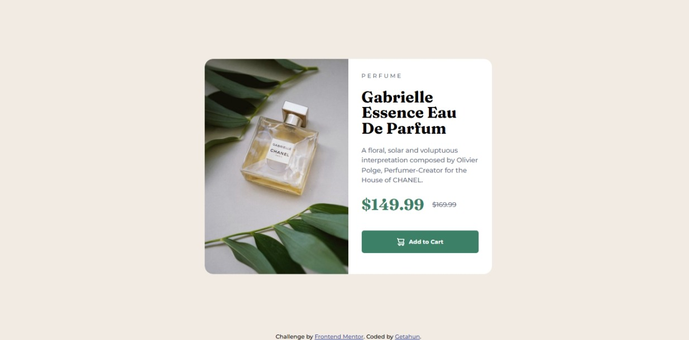
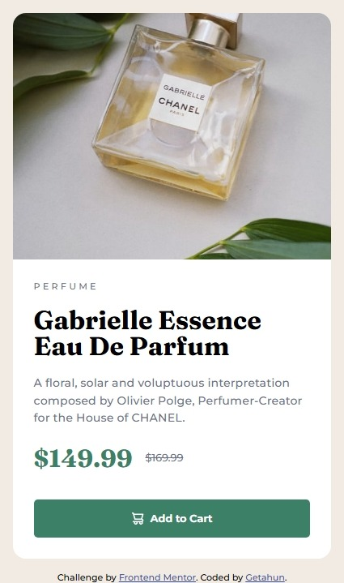

# Frontend Mentor - Product preview card component solution

This is a solution to the [Product preview card component challenge on Frontend Mentor](https://www.frontendmentor.io/challenges/product-preview-card-component-GO7UmttRfa). Frontend Mentor challenges help you improve your coding skills by building realistic projects.

## Table of contents

- [Overview](#overview)
  - [The challenge](#the-challenge)
  - [Screenshot](#screenshot)
  - [Links](#links)
- [My process](#my-process)
  - [Built with](#built-with)
  - [What I learned](#what-i-learned)
  - [Continued development](#continued-development)
  - [Useful resources](#useful-resources)
- [Author](#author)
- [Acknowledgments](#acknowledgments)

## Overview

This project is a solution to the Product Preview Card Component challenge. The goal was to create a responsive product card that showcases an image, title, description, and price, while ensuring it looks good on various screen sizes.
It also includes hover and focus states for interactive elements to enhance user experience.

### The challenge

Your challenge is to build out this product preview card component and get it looking as close to the design as possible.
The designs are in JPG format, so you'll need to use your best judgment for styles. The only assets provided are the product images.

### Screenshot




### Links

- Solution URL: [Add solution URL here](https://github.com/getishe/product-preview-card-component-main.git)
- Live Site URL: [Add live site URL here](https://your-live-site-url.com)

## My process

I started by analyzing the design and breaking down the components needed for the product card. I then set up a React project using Next.js and styled-components for styling. The layout was built using CSS Grid and Flexbox to ensure responsiveness. I focused on creating a clean and accessible design, implementing hover effects for interactive elements, and ensuring the card looks good on both desktop and mobile devices.

### Built with

- Semantic HTML5 markup
- CSS custom properties
- Flexbox
- CSS Grid
- Mobile-first workflow

### What I learned

I learned how to effectively use CSS Grid and Flexbox to create a responsive layout that adapts to different screen sizes. I also improved my skills in using semantic HTML for better accessibility and SEO. Additionally, I practiced implementing hover effects and focus states to enhance user interaction with the product card.

To see how you can add code snippets, see below:

```html
<h1>Some HTML code I'm proud of</h1>
```

```css
.proud-of-this-css {
  color: papayawhip;
}
```

```js
const proudOfThisFunc = () => {
  console.log("🎉");
};
```

### Continued development

Use this section to outline areas that I want to continue focusing on in future projects. These could be concepts I'm still not completely comfortable with or techniques I found useful that I want to refine and perfect.

- Improving my understanding of CSS Grid and Flexbox for more complex layouts.
- Exploring more advanced features of styled-components for better styling management.
- Continuing to enhance my accessibility skills in web development.

### Useful resources

- [CSS Tricks - A Complete Guide to Flexbox](https://css-tricks.com/snippets/css/a-guide-to-flexbox/) - This resource helped me understand how to use Flexbox effectively for layout design.
- [MDN Web Docs - CSS Grid Layout](https://developer.mozilla.org/en-US/docs/Web/CSS/CSS_Grid_Layout) - A comprehensive guide to CSS Grid, which was invaluable for creating responsive layouts.

## Author

- Website - [getishe](https://www.your-site.com)
- Frontend Mentor - [@getishe](https://www.frontendmentor.io/profile/getishe)
- Twitter - [@getishe](https://www.twitter.com/getishe)

## Acknowledgments

I would like to acknowledge the Frontend Mentor community for providing such a great platform to practice and improve my web development skills. The challenges are well-designed and offer a great way to learn and grow as a developer. Special thanks to the designers for creating inspiring designs that motivate me to push my limits.
I also appreciate the feedback and support from fellow developers who have helped me refine my code and improve my understanding of best practices in web development.
